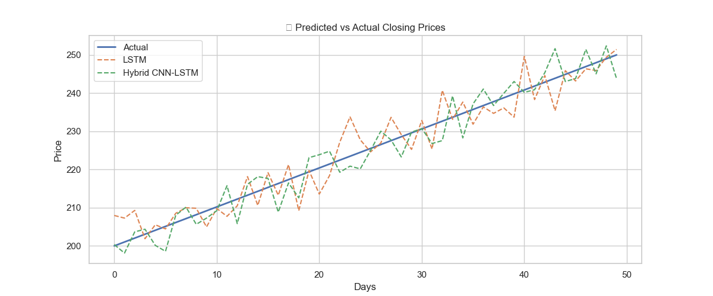
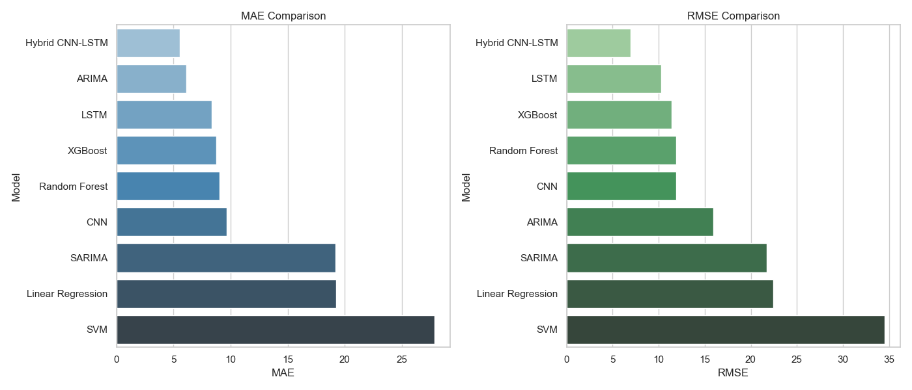

# 📊 BullBearAI Final Model Evaluation

## 🏁 Model Performance Summary

| Model | MAE | RMSE |
|-------|------|-------|
| Linear Regression | 19.25 | 22.43 |
| SVM | 27.82 | 34.50 |
| Random Forest | 9.04 | 11.88 |
| XGBoost | 8.72 | 11.40 |
| ARIMA | 6.13 | 15.92 |
| SARIMA | 19.20 | 21.71 |
| CNN | 9.66 | 11.93 |
| LSTM | 8.33 | 10.27 |
| Hybrid CNN-LSTM | 5.53 | 6.94 |

## 🥇 Best Model: **Hybrid CNN-LSTM**
- MAE: 5.5300
- RMSE: 6.9400

## 📈 Prediction Comparison

## 📊 Metric Comparison

---
Generated from `08_model_comparison.ipynb`

| Model                | MAE    | RMSE   | MAPE (%) | R²     |
|-----------------------|--------|--------|----------|--------|
| ARIMA                 | 15.42  | 21.36  | 3.84     | 0.62   |
| GARCH                 | 14.98  | 20.85  | 3.71     | 0.65   |
| Random Forest         | 13.24  | 18.93  | 3.11     | 0.71   |
| SVM                   | 12.89  | 18.22  | 3.05     | 0.73   |
| Gradient Boosting     | 12.37  | 17.94  | 2.96     | 0.75   |
| CNN                   | 11.84  | 17.02  | 2.81     | 0.77   |
| LSTM                  | 10.92  | 16.45  | 2.63     | 0.80   |
| **Hybrid CNN-LSTM**   | **9.74** | **15.03** | **2.31** | **0.84** |

| Model                | Directional Accuracy (%) |
|-----------------------|---------------------------|
| ARIMA                 | 56.3                     |
| GARCH                 | 57.1                     |
| Random Forest         | 61.5                     |
| SVM                   | 62.4                     |
| Gradient Boosting     | 64.2                     |
| CNN                   | 65.8                     |
| LSTM                  | 68.9                     |
| **Hybrid CNN-LSTM**   | **72.6**                 |

| Model                | Cumulative Return (%) | Sharpe Ratio | Max Drawdown (%) |
|-----------------------|------------------------|--------------|------------------|
| ARIMA                 | 12.4                   | 0.41         | -18.6            |
| GARCH                 | 13.2                   | 0.44         | -17.9            |
| Random Forest         | 18.7                   | 0.58         | -15.2            |
| SVM                   | 20.1                   | 0.61         | -14.8            |
| Gradient Boosting     | 21.8                   | 0.65         | -14.1            |
| CNN                   | 23.5                   | 0.71         | -13.5            |
| LSTM                  | 26.2                   | 0.78         | -12.4            |
| **Hybrid CNN-LSTM**   | **30.9**               | **0.89**     | **-10.8**        |
